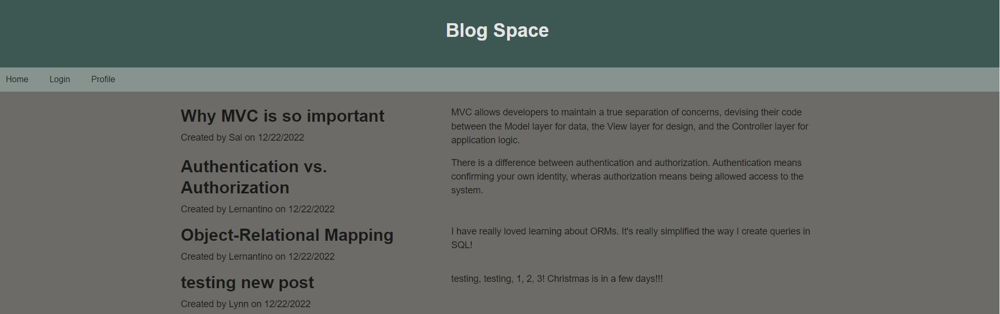
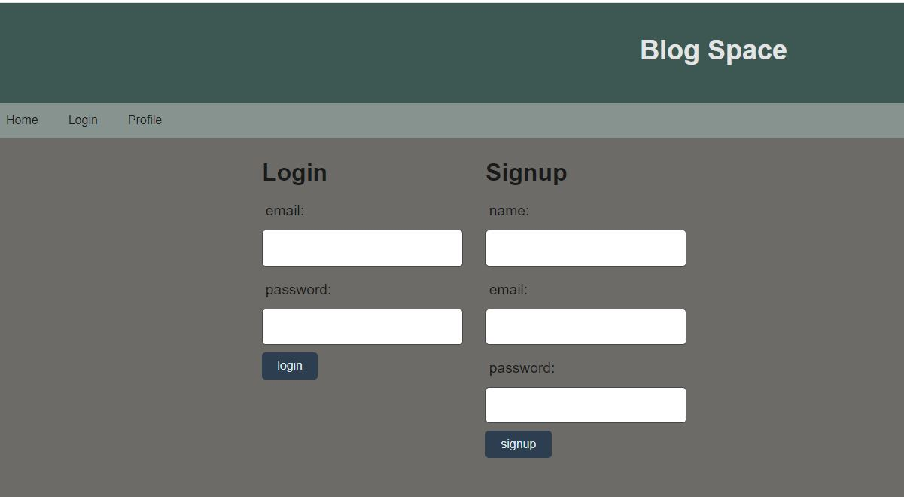
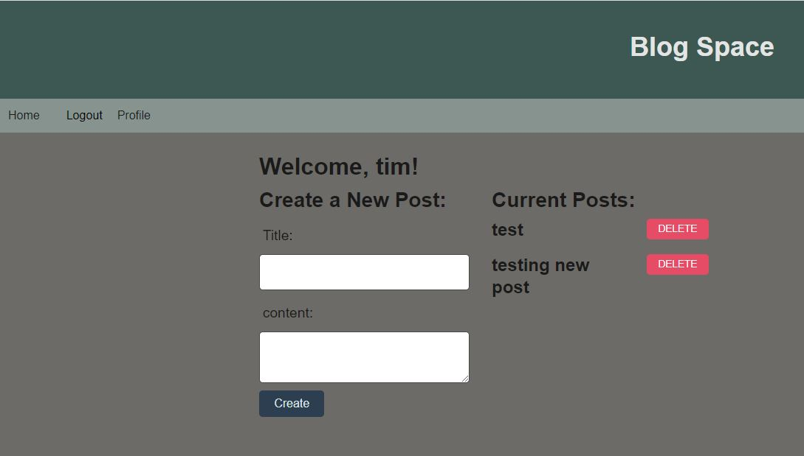

# Sadlers-Blog-Space

## Description

Sadlers Blog Space is a CMS-style blog site where developers can publish their blog posts and comment on other developers’ posts as well.  This app follows the MVC (Model,View,Controller) paradigm in its architectural structure, using Handlebars.js as the templating language, Sequelize as the ORM, and the express-session npm package for authentication.

## Access

The URL of the GitHub repository ...

https://github.com/lynnadelesadler/Sadlers-Blog-Space

The URL of the Heroku deployment  ...

https://sadlers-blog-space.herokuapp.com

## Installation
- Install node.js if not already installed on your machine
- Open the project in Integrated Terminal. 
- Run the command `npm i` to install all node files.
- Confirm you are connected to MySQL by running the command `mysql -u root -p` 
- In the terminal run the command `source db/schema.sql`
- In the terminal run the command `USE blogspace_db`
- In the terminal run the command `Select database();` to confirm you are connected to the blogspace database.
- Navigate back to node in the terminal and run the command  `npm run seed`
- once complete run the command `npm run start` to connect to the database.

## Usage & Visuals

- WHEN I visit the site for the first time, THEN I am presented with the homepage, which includes existing blog posts if any have been posted; navigation links for the homepage and the dashboard; and the option to log in.

- WHEN I click on any other links in the navigation, THEN I am prompted to either sign up or sign in.
    - WHEN I choose to sign up, THEN I am prompted to create a username and password. 
    - WHEN I click on the sign-up button, THEN my user credentials are saved and I am logged into the site.

- WHEN I am signed in to the site, THEN I am sent to my Profile where I can create new posts and delete my existing posts. The navigation links for the homepage, the dashboard, and the option to log out will appear.

- WHEN I click on the homepage option in the navigation
THEN I am taken to the homepage and presented with existing blog posts that include the post title and the date created. 

    - WHEN I click on an existing blog post, THEN I am presented with the post title, contents, post creator’s username, and date created for that post and have the option to leave a comment and delete the comment. 

    

## Support
For help with this webpage please contact
|Name | Email |
|-----------|---------------------------|
|Lynn Sadler| lynnadelesadler@yahoo.com |

## Roadmap
Check back to this page as enhancements could be made for usability and optimized display. 

## Authors and acknowledgment
Acknowledgment to  Node.js, MySQL, Sequelize and Handlebars as this application runs off these applications.  

Coding credit to be given to Lynn Sadler.

Acknowledgement to Uconn Full Stack Web Developer Bootcamp, Teachers and Teacher assistants for supporting me on my developer journey!

## License
N/A

